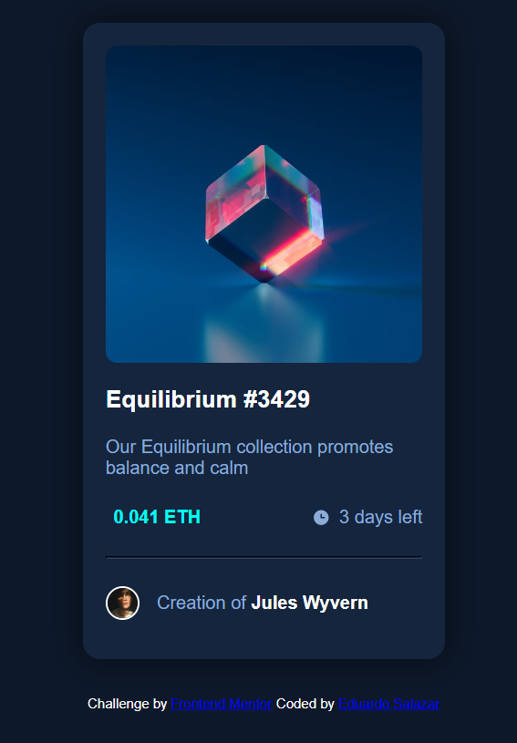

# PROJETO-CARTAO-NFT
Projeto feito para um desafio do Frontendmentor utilizando HTML e CSS

[Clique aqui para acessar](https://eu-salazar.github.io/CARTAO-NFT/)

## Notas:
 
 - Esse projeto de inicio foi mais complicado ate então pelo fato de que nunca tinha feito um projeto que me fizesse ter uma noção maior de como usar os espaços de forma certa para que tudo ficasse em seu devido lugar.
## Tecnologias:
  
 - HTML5
 - CSS3
